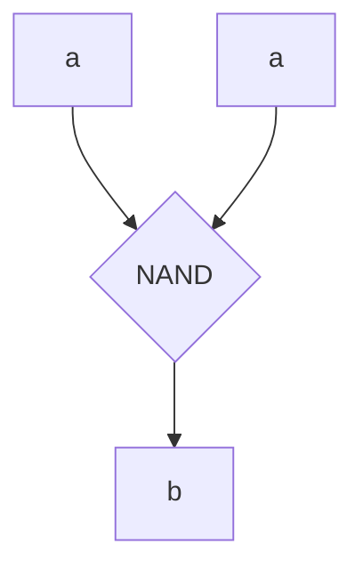

# hss
**hss** stands for **Hardware Simulator System**, and it litterally is what you think it is.

## How to Use

1. First, you need to clone the [GitHub Repo] or to download the [ZIP File].
    ```sh
    git clone https://github.com/SinisterIcy/hss
    ```
2. Then, copy the `hss.js` file to your **project directory**.
3. From here, you need to choose whether you want to exectute commands from a [file] or using a [JS function].

### File

1. Create the file `myFile.hss`
2. Import the `loadFile` function from the `hss.js` file:
    ```js
    const { loadFile } = require('hss.js')
    ```
3. Use the `loadFile()` function to execute your file
    ```js
    loadFile('myFile.hss')
    ```
### JS Function

1. Import the `shell` function from the `hss.js` file:
    ```js
    const { shell } = require('hss.js')
    ```
2. Execute your command by using `shell('<command>')`
```js
shell('log')
```

## Commands

**hss** is able to run a variety of commands such as:
- [vertex]
- [link]
- [update]
- [eval]
- [log]
- [assign]
- [vertices]
- [hide]

### vertex

#### Syntax
```
vertex <name> [value]
```

Creates a new vertex called `name` with the value `value`.

If a `value` is not specified, it will use `0` instead.

#### Example
```
vertex a 1
```
Creates a new vertex called `a` with the value `1`.

### link

#### Syntax
```
link <first_element> <second_element>
```

Links `first_element` to `second_element`.

#### Example
```
vertex a
vertex b
link a b
```
Creates `a` and `b`, and then links them together.

### update

#### Syntax
```
update <vertex> [value]
```

Updates `vertex` and spread `value` (or its value if not specified).

#### Example
```
vertex a
vertex b
link a b
update a 1
```
Creates `a` and `b`, links them together, and then spreads `1` from `a`.

After that, `b` will also be `1`.

### eval

#### Syntax
```
eval <vertex>
```

Prints the value of the vertex.

#### Example
```
vertex a
eval a
```
Creates `a` with the value `1`.

Prints `a`'s value (`1`).

#### Ouptut

```
[a] 0
```

### log

#### Syntax
```
log
```

Logs debug informations.

#### Example
```
vertex a
vertex b 1
log
```
Creates `a` with the value `0`.

Creates `b` with the value `0`.

Prints debug informations.

#### Output

```js
{ a: 0, b: 1 }
{}
{
  nand: [
    Element {
      input_number: 2,
      output_number: 1,
      operation: [Function (anonymous)],
      ins: undefined,
      outs: undefined,
      inputs: [],
      outputs: []
    },
    2,
    1
  ]
}
{ a: true, b: true }
```

### assign

#### Syntax
```
assign <gate_name> <...inputs>, <...outputs>
```

Creates a new gate with the logic between the `<...inputs>` and `<...outputs>`.

#### Example
```
vertex a 1
vertex b
link nand a a b
assign not a, b
```
Creates `a` with the value `1`.

Creates `b` with the value `0`.

Creates links `a` and `b` with the NAND gate.

Creates the new gate `not` with the logic between `a` and `b`.


| `a` | `b` |
|-|-|
| 0 | 1 |
| 1 | 0 |

### vertices

#### Syntax
```
vertices [all]
```

Outputs vertices informations.

If the `all` flag is not precised, it will only show availiable vertices

#### Example
```
vertex a 1
vertex b
link nand a a b
assign not a, b
vertex c
vertices
vertices all
```
Creates `a` with the value `1`.

Creates `b` with the value `0`.

Creates links `a` and `b` with the NAND gate.

Outputs availaible vertices.

Outputs all vertices.

#### Output

```
Vertex: c
Value: 0

Vertex: a
Value: 1
Available: No

Vertex: b
Value: 0
Available: No

Vertex: c
Value: 0
Available: Yes
```

### hide

#### Syntax
```
hide <vertex>
```

Hides `<vertex>` from `vertices` and `vertices all`

#### Example
```
vertex a 1
vertex b
hide a
vertices
```
Creates `a` with the value `1`.

Creates `b` with the value `0`.

Hides `a`.

Outputs vertices informations.

#### Output

```
Vertex: b
Value: 0
```

[GitHub Repo]: https://github.com/SinisterIcy/hss
[ZIP File]: https://github.com/SinisterIcy/hss/archive/refs/heads/main.zip
[file]: #file
[JS function]: #js-function
[vertex]: #vertex
[link]: #link
[update]: #update
[eval]: #eval
[log]: #log
[assign]: #assign
[vertices]: #vertices
[hide]: #hide
